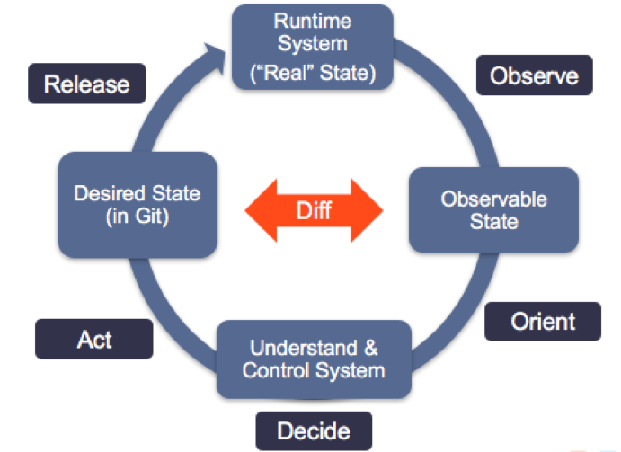

### Tekton

A kubernetes native CI/CD tool


----


### Why Tekton CD?

Or why not jenkins.

well tekton is;
- native to the platform (kubernetes),
- decoupled,
- typed.

---

## How does it work.

### Tasks

Equivalent to a jenkins stage definition, have the following;

- params (strings, numbers),
- resources (images, gits),
- results (string, numbers),
- workspaces (folders paths)

Each task has a least one step,
each step is run in an image

----

```
apiVersion: tekton.dev/v1beta1
kind: Task
metadata:
  name: example-task-name
spec:
  params:
    - name: pathToDockerFile
      type: string
  resources:
    inputs:
      - name: workspace
        type: git
    outputs:
      - name: builtImage
        type: image
```
----
```
  steps:
    - name: ubuntu-example
      image: ubuntu
      args: ["ubuntu-build-example", "SECRETS-example.md"]
    - image: gcr.io/example-builders/build-example
      command: ["echo"]
      args: ["$(params.pathToDockerFile)"]
    - name: dockerfile-pushexample
      image: gcr.io/example-builders/push-example
      args: ["push", "$(resources.outputs.builtImage.url)"]
```

---

### Tasks Runs

A TaskRun allows you to instantiate and execute a Task on-cluster.

---
### Pipeline

A Pipeline is a collection of Tasks that you define and arrange in a specific order of execution as part of your continuous integration flow.

---
### Pipeline Run

A PipelineRun allows you to instantiate and execute a Pipeline on-cluster.

---

## The cool Aid \*

- You have to use a git ops CI/CD



---

## The cool Aid \*

- You have to use a git ops style CI/CD
  - It is (should be) safer,
  - It is (should be) easier to duplicate and environment
  - It is (should be) easier to debug

---

## Demo
